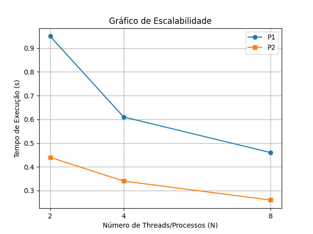

# Trabalho_Sisop
Trabalho 1 da disciplina de Sistemas Operacionais.

Integrantes do grupo:
- Ana Paula da Silva Pereira
- Arthur Rosa Ferreira
- João Gabriel de Oliveira Olivas
- Luthero Vargas

O projeto tem como objetivo comparar o desempenho entre processos e threads em ambiente Unix-like, analisando overhead de criação, comunicação e consistência de dados.

------------------------------------INSTRUÇÕES---------------------------------------

Como rodar:

-Passo 1
Clonar o projeto com o comando:
"git clone https://github.com/arthurrosa99/Trabalho_Sisop".

-Passo 2 
Como utilizamos MAKEFILE para compilar pode apenas utilizar o comando: 
"make".

-Passo 3 
Como utilizamos MAKEFILE para rodar o programa pode apenas utilizar o comando: 
"make run".

*OPCIONAL DO PASSO 2 E 3*

Caso não utilize o Makefile, o projeto pode ser compilado e executado manualmente com os seguintes comandos:

Compilação:
"gcc src/main.c src/threads.c src/processos.c -Iinclude -o trab -lpthread"

Execução:
"./trab"

Observação:
A flag -lpthread é necessária para o uso de threads (pthreads).

------------------------------------PROCESSOS----------------------------------------
## Assinatura do Hardware

A identificação do hardware foi obtida por meio do comando:
"sysctl -a | grep hw.ncpu"

Resultado:
hw.ncpu: 10

Isso indica que a máquina utilizada possui **10 núcleos de CPU**.

## Tabela de Tempo de Execução

Os tempos de execução foram obtidos utilizando o comando:
"time ./trab"

Onde:
- **P1**: execução sem sincronização.  
- **P2**: execução com sincronização. 

| N | P1 (s)| P2 (s)| 
| - | ------ | -----|
| 2 | 0,95   | 0,44 | 
| 4 | 0.61   | 0,34 | 
| 8 | 0.46   | 0,26 | 

Observações: O código foi executado **três vezes para cada valor de N**, os valores apresentados na tabela correspondem à **média dos tempos obtidos**.

## Grafico de Escalabilidade

