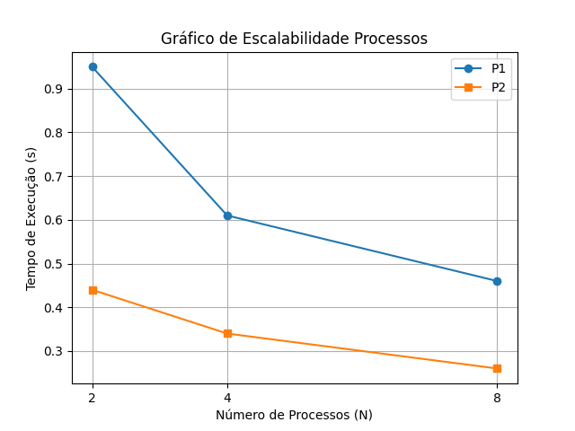
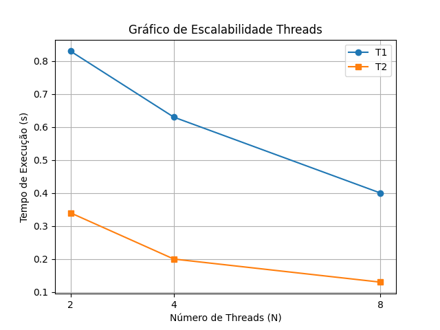
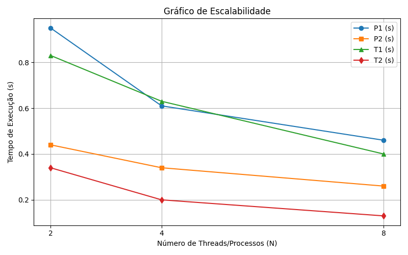

# Trabalho_Sisop
Trabalho 1 da disciplina de Sistemas Operacionais.

Integrantes do grupo:
- Ana Paula da Silva Pereira
- Arthur Rosa Ferreira
- João Gabriel de Oliveira Olivas
- Luthero Vargas

O projeto tem como objetivo comparar o desempenho entre processos e threads em ambiente Unix-like, analisando overhead de criação, comunicação e consistência de dados.

------------------------------------INSTRUÇÕES---------------------------------------

Como rodar:

-Passo 1
Clonar o projeto com o comando:
"git clone https://github.com/arthurrosa99/Trabalho_Sisop".

-Passo 2 
Como utilizamos MAKEFILE para compilar pode apenas utilizar o comando: 
"make".

-Passo 3 
Como utilizamos MAKEFILE para executar o programa pode apenas utilizar o comando: 
"make run".

*OPCIONAL DO PASSO 2 E 3*

Caso não utilize o Makefile, o projeto pode ser compilado e executado manualmente com os seguintes comandos:

Compilação:
"gcc src/main.c src/threads.c src/processos.c -Iinclude -o trab -lpthread"

Execução:
"./trab"

Observação:
A flag -lpthread é necessária para o uso de threads (pthreads).

------------------------------------PROCESSOS----------------------------------------
## Assinatura do Hardware

A identificação do hardware foi obtida por meio do comando:
"sysctl -a | grep hw.ncpu"

Resultado:
hw.ncpu: 10

Isso indica que a máquina utilizada possui **10 núcleos de CPU**.

## Tabela de Tempo de Execução

Os tempos de execução foram obtidos utilizando relógios para medir o tempo e tambem o comando:
"time ./trab"

Onde:
- **P1**: execução sem sincronização.  
- **P2**: execução com sincronização. 

| N | P1 (s)| P2 (s)| 
| - | ------ | -----|
| 2 | 0,95   | 0,44 | 
| 4 | 0.61   | 0,34 | 
| 8 | 0.46   | 0,26 | 

Observações: O código foi executado **três vezes para cada valor de N**, os valores apresentados na tabela correspondem à **média dos tempos obtidos**.

## Grafico de Escalabilidade

-------------------------------------THREADS-----------------------------------------
## Assinatura do Hardware

A identificação do hardware foi obtida por meio do comando:
"sysctl -a | grep hw.ncpu"

Resultado:
hw.ncpu: 10

Isso indica que a máquina utilizada possui **10 núcleos de CPU**.

## Tabela de Tempo de Execução

Os tempos de execução foram obtidos utilizando relógios para medir o tempo e tambem o comando:
"time ./trab" 

Onde:
- **T1**: execução sem sincronização.  
- **T2**: execução com sincronização. 

| N | T1 (s)|T2 (s)| 
| - | ------| -----|
| 2 | 0,83  | 0,34 | 
| 4 | 0,63  | 0,20 | 
| 8 | 0,40  | 0,13 | 

Observações: O código foi executado **três vezes para cada valor de N**, os valores apresentados na tabela correspondem à **média dos tempos obtidos**.

## Grafico de Escalabilidade

--------------------------------PROCESSOS X THREADS----------------------------------

## Tabela de Tempo de Execução

| N | P1 (s)| P2 (s)| T1 (s)| T2 (s)|
| - | ------| ----- |-------|-------|
| 2 | 0,95  | 0,44  | 0,83  | 0,34  |
| 4 | 0.61  | 0,34  | 0,63  | 0,20  |
| 8 | 0.46  | 0,26  | 0,40  | 0,13  |

## Análise de Corrupção

Os valores finais do contador ficaram abaixo de 1 bilhão devido a race conditions: múltiplos processos (P1) ou threads (T1) acessaram e incrementaram o contador simultaneamente sem sincronização, fazendo com que alguns incrementos fossem perdidos. Quanto mais threads/processos, maior a sobreposição com isso menor o valor final. O hardware do grupo influenciou porque CPUs com diferentes números de núcleos, caches e latências de memória afetam como threads/processos acessam o contador simultaneamente, aumentando ou diminuindo a chance de race conditions e, assim, alterando o valor final, mas o problema principal é a falta de controle sobre o acesso concorrente.

## Resultados Obtidos

                    --------- SEM SYNC PROCESOS --------
                     Processos sem sync (2): 497000724
                     Processos sem sync (4): 251162544
                     Processos sem sync (8): 113154338

                    --------- COM SEMÁFORO PROCESOS -------
                     Processos com semaforo (2): 1000000000
                     Processos com semaforo (4): 1000000000
                     Processos com semaforo (8): 1000000000

                    --------- SEM MUTEX THREADS --------- 
                     Threads sem mutex (2): 501079427
                     Threads sem mutex (4): 250541840
                     Threads sem mutex (8): 126113878

                    --------- COM MUTEX THREADS --------- 
                     Threads com mutex (2): 1000000000
                     Threads com mutex (4): 1000000000
                     Threads com mutex (8): 1000000000

## Grafico de Escalabilidade

## Conclusão Final

Threads são mais eficientes na criação e na comunicação entre unidades de execução, já os processos apresentam um overhead maior devido à separação de espaço de memória e recursos do sistema, mas ainda funcionam corretamente quando adequadamente sincronizados. O uso de mecanismos de sincronização é essencial para garantir a consistência dos dados em ambos os modelos. Além disso, no quesito comunicação nativa, threads têm desempenho superior em comparação com processos, tornando-as mais ágeis para cenários de alto paralelismo.
